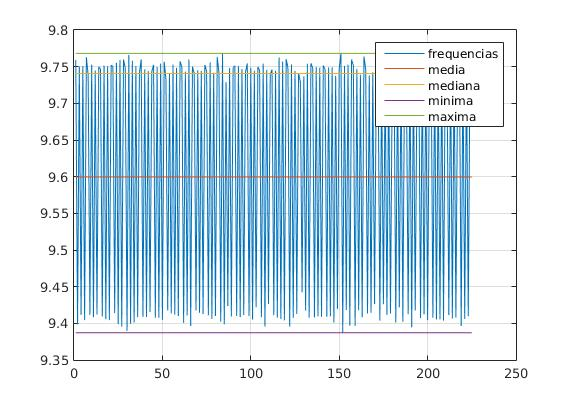
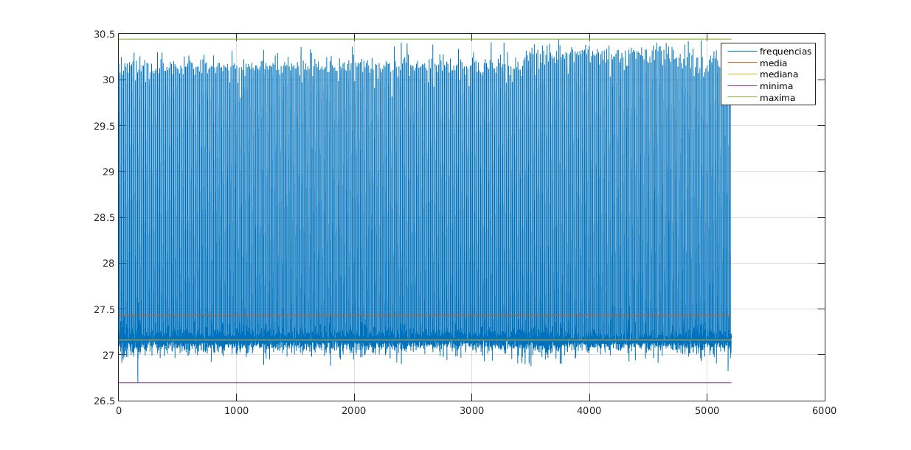
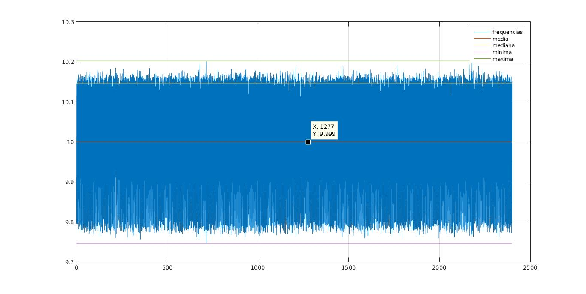

# Testes do Timer
Testes usados para confirmar o timer.

## Realização do Teste

* **nRF24LE1**: Envia dados na serial toda vez que o timer da um 'tick'.
* **Arduino**: Redireciona os valores lido na serial1 para a serial0, que será lida pelo computador.
* **SalvaLeituras.py**: Lê cada linha de dados e escreve num arquivo de log, junto a informação do horário que realizou a leitura, informado pelo computador.
* **importtimes.m**: Importa um vetor com os 'datetimes' salvos no arquivo de log.
* **Matlab**: calcula o tempo entre cada leitura e com isso determina a frequência.

## Resultados

* Timers com funções uart dentro da interrupção:
    * **Timer em 10Hz**

    * **Timer em 30Hz**

* Timers com funções uart separadas e interrupção apenas altera uma flag.
    * **Timer em 10Hz**

    * **Timer em 30Hz**

