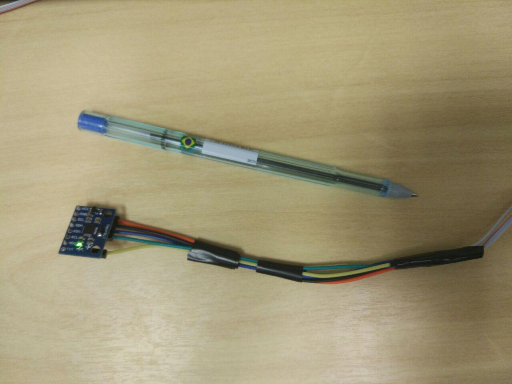
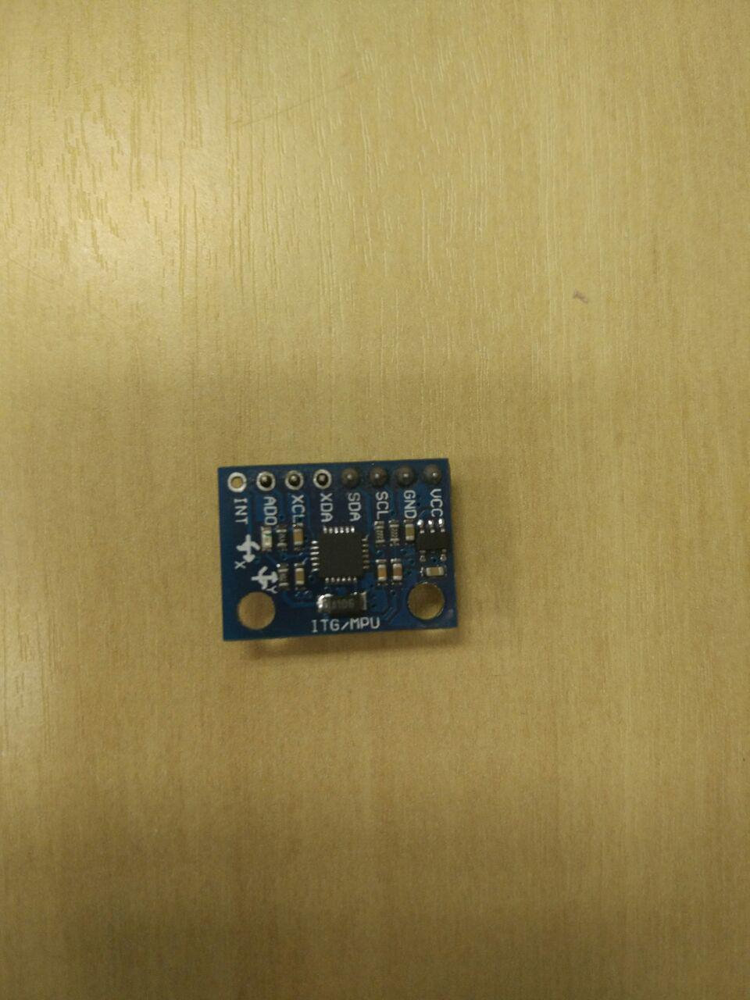

# Rastreamento Inercial
This project is about the development of a tracking system, based on the use of inertial sensors in a wireless network. This sensors are placed at the body segments that will be tracked and they send their data to a host computer. This computer can show the movement execution in real time and allow the usage of these data to analyzes and studies. To do that, small wearable modules are being developed, in which there will be a micro-controller an inertial sensor and a radio frequency transponder, all inside a small box made by a 3D printer. Also, an acquisition system and a user interface are being developed.

## Arquivos do repositório
* **FIRMWARE**:
  * Arduino: Contém um projeto do platformIO com o código para o arduino Due que será utilizado como host. Tambem contém as bibliotecas necessárias para utiliza-lo, no caso "DueTimer" e "nrf24le01Module".
  * nrf24le1: Código dos sensores utilizando o rf transponder nrf24le1. Tambem estao junto a ele as bibliotecas necesárias: "API.h", "dmp.h", "hal_w2_isr.h", "mpu_calibration", "mpu6050_reg.h", "nRF-SPIComands.h", "pacotes_inerciais.h", "timer0.h".
* **HARDWARE**:
  * 3D printing:
  * PCBs:
* **SOFTWARE**:
  * Matlab analysis: Ainda não implementada.
  * Python Framework: Software feito com pyQt que se comunicará com o Arduino e executará as rotinas de leitura e salvamento das coletas.
* Codigos para consulta e referencias: Códigos úteis durante o desenvolvimento de novas aplicações e aprendizagem sobre as ferramentas utilizadas.

## Imagens do sistema
* HOST:
    * Com fio:

    * Sem fio:

* Sensores:

* nrf24le1:

* nrf24le01:

* mpu6050:

* Caixinhas:

* PCBS:

* Python Framwork:

* Sistema de Testes:

## Prerequisites

* Arduino IDE ou platformIO integrado com Atom através do pacote platomformio (preferivel).
* Keil uVision5 full Version: IDE para compilar e também editar os códigos que irão para o transponder nRF24LE1.
* mPro: Gravador para enviar os arquivos compilados pelo keil para o nRF24LE1.
* Python 2.7.
* Matlab.

## Installing

Verifique os arquivos de instalação no Google Drive.

## Authors

* Ítalo G S Fernandes.
* Eduardo Morais.
* Sergio Ricardo de Jesus.
* Andrei Nakagawa.
* Ana Carolina Torres.

## License

Este projeto esta sobre a licença MIT. Veja o aquivo license para mais informações.
