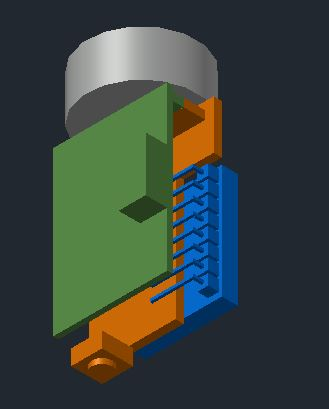
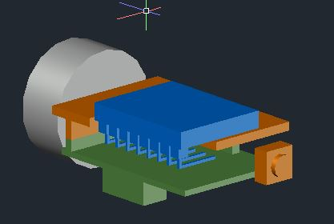
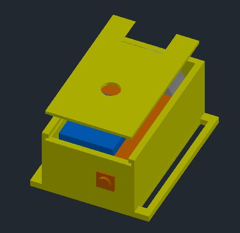

# Rastreamento Inercial
This project is about the development of a tracking system, based on the use of inertial sensors in a wireless network. This sensors are placed at the body segments that will be tracked and they send their data to a host computer. This computer can show the movement execution in real time and allow the usage of these data to analyzes and studies. To do that, small wearable modules are being developed, in which there will be a micro-controller an inertial sensor and a radio frequency transponder, all inside a small box made by a 3D printer. Also, an acquisition system and a user interface are being developed.

## Arquivos do repositório
* **PROJETO FINAL**:  
    * Host_raspberry-codes: Programa em python para ser rodado na raspberry, ele lê a sua porta serial e mostra de uma forma legivel o que foi enviado.
    * modulo_sensor_code: Implementação das Bibliotecas que serão utilizadas, assim como programa que realiza leituras quando requisitado e envia para host.
    * nrf_Host_code: Módulo nRF24LE1 responsável por receber os dados dos demais.
* **3D**: CADs 3D dos módulos que serão usados. Será impressa uma pequena caixa de acordo com estes CADs. Foi utilizado o autocad para modelagem.
* **Arduino**: *"Sketch"*  para serem enviados para o arduino.
    * **Host1Sensor**: Ainda em necessário monta-la, será utilizado para receber os dados de 1 board nRF24LE1 conectada aos sensores e, então, os enviar para o computador via Serial. Ainda não está definido se tratará os dados no HOST ou no MATLAB ou no C#.
    * I2C_slave_to_serial: Foi utilizada apenas para testes, redireciona dados lidos pela interface I2C para a Serial.
    * Leitor Sensores: Foi utilizada apenas para testes. Exemplo para leitura dos dados sensores. Não será usado no final.
    * Obtencao_de_pacotes: Obtem um pacote de leituras inerciais na sua forma com váriveis de 8 bits cada. Para sser utilizada a biblioteca i2clib foi levemente alterada para que envie os pacotes na forma "bruta".
    * **Redireciona Serial**: Sendo utilizado para redirecionar o que é recebido no serial1 para o serial0. Permitindo comunicação UART com o nRF24LE1. Possívelmente será utilizado para testes se os pacotes forem tratrados no MATLAB ou C#.
* C# - Serial: Programinha em C# bem simples somente para ler uma porta serial, não tem nem interface. Pode ser útil para conhecimento e para aprender como comunicar o C# com o serial quando for fazer a interface C#, mas por enquanto é bem inutil.
* **eagle**: Projeto no software cad eagle para a confecção de uma PCB utilizando o CI MAX232 para não ser mais necessário um arduino para redirecionar a Serial para o Computador.
* **proteus**: Projeto no software Proteus de uma PCB minituarizada que conectará o rf transponder ao sensor inercial para formar o módulo. Está presente um esquematico com todas as conexões e uma PCB que deverá ser confeccionada.

* **Keil**: Projetos escritos, para o nRF24LE1. Projetos fora das pastas Testados e Não Testados estão sendo desenvolvidos.
    * Não Testados: Varios projetos antigos que não exclui. Quase inútil.
    * blink: Pisca os leds, foi testado e funciona bem.
    * btn_and_led: Ao se apertar um botão em um rádio é alterado o estado de um led em outro rádio.
    * Serial: Somente envia alguns 'Lorem ipsum' por comumicação UART.
    * Timer: Utilização de funções no Timer0. Existe um timer de 30Hz e um de 10Hz. Foi testado e existem gráficos do funcionamento.
        * Timer: Timer de 30Hz.
        * Timer_10_Hertz: Timer de 10HZ.
    * send_false_packet: Envia um pacote falso para um radio receptor, este recebe e encaminha para uma porta serial.
    * Interrupt: Código de funcionamento de uma interrupção semelhante a que utilizaremos.
    * **I2C_Testes**: Testes realizados durante a construção da biblioteca I2C, não é mais útil já que a biblioteca está pronta.
* **Python**: Um data-logger bem útil pra salvar algumas leituras se for preciso. Há, também, algumas leituras salvas e plotadas no matlab. Este data-logger pode ser utilizado para verificar a frequência de aquisição do sistema através de um código do matlab.
* UNITY: Projeto no unity para o rastreamento por angulos de um braço. Devido a um problema com o computador os códigos foram perdidos, é necessário que seja refeito.

## UNITY

## Resultado do teste do send false packet

Frequência de amostragem X amostras

## Imagens do módulo que será impresso:

### Prerequisites

* Seu editor de texto preferido (Atom, sublimeText, gedit...)
* Keil uVision5: IDE para compilar e também editar os códigos que irão para o transponder nRF24LE1.
* mPro: Gravador para enviar os arquivos compilados pelo keil para o nRF24LE1.
* raspberry: Sistema que pode ser utilizado como host.
* arduino due: Sistema que pode ser utilizado como host. Instalar placa na IDE do arduino.
* Biblitcas para arduino: Será utilizada a [I2C dev-lib](http://www.i2cdevlib.com/devices/mpu6050). Siga o link para instalar.
*  [nRF24LE1: ](http://www.nordicsemi.com/eng/Products/2.4GHz-RF/nRF24LE1): Acesse o link, va na aba downloads, existem vários arquivos explicando o sistema. O mais util é:  	"Creating Applications with the Keil C51 C Compiler"

### Installing

*  [Atom: ](https://atom.io/) - Bom para editar código. baixe e caso queira instale suas extenções para facilitar o uso.
*  Arduino Due:
    * Baixar a ide do Arduino normalmente
    * Ir em Boards, pesquisar Arduino Due, instalar placa.
    * Utilizar programing port.
* Keil: Link proibido: https://www.youtube.com/watch?v=xSqIlKJOs6A
* I2CDEVLIB:
    * Acesse seu github no link:  https://www.github.com/jrowberg/i2cdevlib/tree/master/Arduino/MPU6050
    * clique em download.
    * baixe e copie para a pasta Documentos/Libraries.
* mPro burner: Siga o arquivo de instalação das coisas do Sergio, se tiver em chines utilize o google tradutor para traduzir.

## Como Utilizar
* Foram implementadas Bibliotecas baseadas na I2CDEVLIB:
    * Antes de começar verifique seus exemplos para a mpu6050 no arduino e entenda-os:
    * Vá nos arquivos da Bibliotecae veja sua implementação:
        * I2CDEV.h: Biblioteca I2C é onde toda a comunicação ocorre.
        * MPU6050.h: Definições de registradores e metodos para setar e ler cada registradores, faz chamada das funções em I2CDEV
        * MotionApps.h: Biblioteca para utilizar a DMP interna do MPU6050 e programa-la, utiliza as 2 acima. É extremamente necessária para o calculo dos quaternios.
    * Verifique a pasta Working on It/libraries.
        * hal_i2c: esta para I2CDEV.
        * MPU6050.h: tem somente as definições de registradores
        * dmp.h: implementa as de MotionApps e MPU6050. Esta implementado apenas os que iram ser utilizados para obter os quaternios.
        * Para implementar mais funções verifique a sua implementação para arduino e a documentação de I2CDEV.
* Compile o codigo no Keil uVision5 assim como o tutorial do nRF24LE1. É apenas necessário gerar o arquivo .hex. Para isso configure seu projeto para gera-lo. Verifique a pasta.
* abra o mpro, conect-se a placa, de um load no .hex. Clique em auto para gravar.

## Authors

* **serginho**
* eu
* eduardo

## License
Não compartilhe esse projeto pois ele possui coisas na licença.
