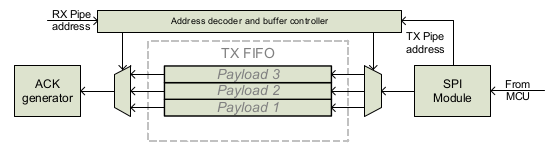

# Sobre o nRF24LE1

## RF Transceiver - Dúvidas

* **GFSK**: `Gaussian Frequency Shift Keying`. Acho que é uma modulação onde a frequência do sinal é alterada de acordo com o bit que se deseja enviar.
* **ISM**: Insdustrial, Scientific and Medical radio bands. Vai de 2.400 a 2.4835 GHz. No Brasil é dividida em 11 canais de 22 MHz. O canal que será usado pode ser configurado nos registers do transceiver.
* **ShockBurst**: `???` O pacote é enviado, e caso não tenha retorno é renviado uma quantidade de vezes definida.
* **Enhanced ShockBurst**: Um ShockBurst onde é adicionado uma flag de 9 bits entre o Endereço e a Payload, somente 2 bits são usados (PID), neles é escrita a quantidate de retransmições.
* **SPI**: `Serial Peripheral Interface`. Protocolo de comunicação composto por 4 sinais:
    * SCLK : Serial Clock (output from master).
    * MOSI : Master Output, Slave Input (output from master).
    * MISO : Master Input, Slave Output (output from slave).
    * SS : Slave Select (active low, output from master).
* **Output power (dBm)**:`???` O que significa essa unidade? No nRF24LE1 existem as opções 0, -6, -12, -18. O default é o 0. Quantos metros +- consigo alcançar? Melhora o consumo de energia diminuir o valor, mas até quanto devo?

RF_PWR | RF output power | DC consumption
------------ | ------------- | -------------
11 | 0dBm | 11.1mA
10 | -6dBm | 8.8mA
01 | -12dBm | 8.3mA
00 | -18dBm | 6.8mA

* **Block diagram**:

* **State diagram**:

* **Packet Format**:

ShockBurst:

Preamble | Address | Payload | CRC
-------- |-------- |-------- |--------
1 byte | 3 - 5 bytes | 0 - 32 bytes | 1 - 2 bytes
8 bits | 24 - 40 bits | 0 - 256 bits | 8 - 16 bits
01010101 ou 10101010 | ADDR |

    * Quando usar Payload static ou dinamica
    * PID
    * ACK
    * CRC: Como detecta o erro?

* **Automatic packet assembly**:

* **Automatic packet disassembly**:

* **Auto Acknowledgement**: Is enabled by setting EN_AA register. Se o pacote tiver a flag NO_ACK, auto-ack não é executada. Para ativar o ACK o DPL deve estar ativado. W_ACK_PAYLOAD command. 3 nívels da fifo.

* Ver Datasheet a partir da **página 28**.
